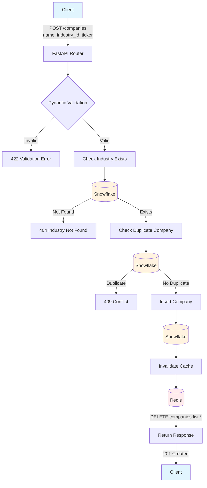

# PE Org-AI-R Platform Foundation

A REST API platform for assessing organizational AI readiness across portfolio companies. Built with FastAPI, Snowflake, Redis, and AWS S3.

## Table of Contents

- [Quick Start](#quick-start)
- [Starting the Application](#starting-the-application)
- [Stopping the Application](#stopping-the-application)
- [Directory Structure](#directory-structure)
- [Technology Stack & Packages](#technology-stack--packages)
- [Project Implementation Summary](#project-implementation-summary)
- [Infrastructure Diagram](#infrastructure-diagram)
- [Data Flow Examples](#data-flow-examples)
- [API Documentation](#api-documentation)

---

## Quick Start

```bash
# 1. Clone the repository
git clone https://github.com/BigDataIA-Spring26-Team-5/PE_OrgAIR_Platform_Foundation.git
cd pe-org-air-platform

# 2. Copy environment template and configure
cp .env.example .env
# Edit .env with your credentials (Snowflake, AWS, Redis)
```

### Using Poetry (Recommended)

Poetry handles virtual environment creation and dependency management automatically.

```bash
# Install Poetry (if not already installed)
pip install poetry

# Install all dependencies (creates venv automatically)
poetry install

# Activate the virtual environment
poetry env activate

# Copy and paste the output in your command line, It should be something like:
& "C:\Users\...\pe-org-air-platform\.venv\Scripts\activate.ps1"

# Install additional packages which are not available through poetry (eg. python-jobspy)
pip install -r requirements.txt
```

---

## Starting the Application

### Docker Compose

This starts both the FastAPI application and Redis cache:

```bash
# Run from project root directory
docker-compose -f docker/docker-compose.yml -p pe_orgair up --build -d
```

**Services started:**

| Service | Container Name | Port | Description |
|---------|----------------|------|-------------|
| API | pe_orgair_platform_api | 8000 | FastAPI application |
| Redis | pe_orgair_platform_redis | 6379 | Cache layer |

**Access points after startup:**
- API Base URL: http://localhost:8000
- Swagger UI: http://localhost:8000/docs
- ReDoc: http://localhost:8000/redoc
- OpenAPI JSON: http://localhost:8000/openapi.json
- Health Check: http://localhost:8000/health


### Verify Application is Running

```bash
# Health check endpoint
http://localhost:8000/health (or) http://127.0.0.1:8000/health

# Expected response (all services healthy):
{
  "status": "healthy",
  "timestamp": "2026-01-30T12:00:00Z",
  "version": "1.0.0",
  "dependencies": {
    "snowflake": "healthy (User: PEORGAIRPLATFORM)",
    "redis": "healthy (URL: redis://redis:6379/0)",
    "s3": "healthy (Bucket: pe-orgair-platform, Region: us-east-2)"
  }
}
```

---

## Stopping the Application

### Docker Compose

```bash
# Stop containers (from project root)
docker-compose -f docker/docker-compose.yml -p pe_orgair down

# Stop and remove volumes (clears Redis data)
docker-compose -f docker/docker-compose.yml -p pe_orgair down -v

# Stop and remove everything (containers, networks, volumes, images)
docker-compose -f docker/docker-compose.yml -p pe_orgair down -v --rmi all
```

### Graceful Shutdown Behavior

The application handles shutdown gracefully:
1. **SIGTERM/SIGINT signals** trigger cleanup
2. **Active requests** are allowed to complete
3. **Database connections** are closed properly
4. **Cache connections** are terminated cleanly

---

## Directory Structure

```
pe-org-air-platform/
├── app/                              # Main FastAPI application
│   ├── core/                         # Core utilities
│   │   ├── dependencies.py           # FastAPI dependency injection
│   │   └── exceptions.py             # Custom exception classes
│   ├── database/                     # Database configurations
│   ├── models/                       # Pydantic data models
│   │   ├── assessment.py             # Assessment schemas
│   │   ├── company.py                # Company schemas
│   │   ├── dimension.py              # Dimension score schemas
│   │   ├── enumerations.py           # Enums (AssessmentType, Status, Dimension)
│   │   └── industry.py               # Industry schemas
│   ├── repositories/                 # Data access layer (Snowflake)
│   │   ├── base.py                   # Base repository with connection management
│   │   ├── assessment_repository.py  # Assessment CRUD operations
│   │   ├── company_repository.py     # Company CRUD operations
│   │   ├── dimension_score_repository.py # Dimension score operations
│   │   └── industry_repository.py    # Industry CRUD operations
│   ├── routers/                      # API endpoint handlers
│   │   ├── assessments.py            # /api/v1/assessments endpoints
│   │   ├── companies.py              # /api/v1/companies endpoints
│   │   ├── dimensionScores.py        # /api/v1/scores endpoints
│   │   ├── health.py                 # /health endpoints
│   │   └── industries.py             # /api/v1/industries endpoints
│   ├── services/                     # Business logic services
│   │   ├── cache.py                  # Cache service singleton
│   │   ├── redis_cache.py            # Redis caching implementation
│   │   ├── s3_storage.py             # AWS S3 document storage
│   │   └── snowflake.py              # Snowflake connection factory
│   ├── config.py                     # Application settings (Pydantic)
│   └── main.py                       # FastAPI app initialization
├── docker/                           # Docker configuration
│   ├── Dockerfile                    # FastAPI container build
│   └── docker-compose.yml            # Multi-container orchestration
├── tests/                            # Test suite
│   ├── conftest.py                   # Pytest fixtures
│   ├── test_api.py                   # API endpoint tests
│   ├── test_models.py                # Pydantic model tests
│   └── test_redis_cache.py           # Cache service tests
├── streamlit/                        # Dashboard UI (optional)
│   └── app.py                        # Streamlit dashboard
├── .env.example                      # Environment template
├── .gitignore                        # Git ignore rules
├── pyproject.toml                    # Poetry configuration
├── requirements.txt                  # Python dependencies
└── README.md                         # This file
```

---

## Technology Stack & Packages

### Core Framework

| Package | Version | Purpose |
|---------|---------|---------|
| fastapi | >=0.109.0 | Modern async web framework |
| uvicorn[standard] | >=0.27.0 | ASGI server |
| pydantic | >=2.5.0 | Data validation & settings |
| pydantic-settings | >=2.1.0 | Environment configuration |
| starlette | >=0.35.0 | ASGI middleware |

### Database & Storage

| Package | Version | Purpose |
|---------|---------|---------|
| snowflake-connector-python | >=3.6.0 | Snowflake database driver |
| snowflake-sqlalchemy | >=1.5.0 | SQLAlchemy dialect |
| sqlalchemy | >=2.0.0 | ORM and SQL toolkit |
| redis | >=5.0.0 | Redis client for caching |
| hiredis | >=2.3.0 | C parser for Redis protocol |
| boto3 | >=1.34.0 | AWS SDK (S3 storage) |

### Data Processing

| Package | Version | Purpose |
|---------|---------|---------|
| pandas | >=2.1.0 | Data manipulation |
| numpy | >=1.26.0 | Numerical computing |
| pyarrow | >=14.0.0 | Arrow serialization |

### Security

| Package | Version | Purpose |
|---------|---------|---------|
| python-jose[cryptography] | >=3.3.0 | JWT tokens |
| passlib[bcrypt] | >=1.7.4 | Password hashing |
| cryptography | >=41.0.0 | Cryptographic operations |


### Observability

| Package | Version | Purpose |
|---------|---------|---------|
| opentelemetry-api | >=1.22.0 | Distributed tracing API |
| opentelemetry-sdk | >=1.22.0 | Tracing SDK |
| opentelemetry-instrumentation-fastapi | >=0.43b0 | Auto-instrumentation |
| structlog | >=24.1.0 | Structured logging |

### Testing & Development

| Package | Version | Purpose |
|---------|---------|---------|
| pytest | >=8.0.0 | Test framework |
| pytest-asyncio | >=0.23.0 | Async test support |
| pytest-cov | >=4.1.0 | Coverage reporting |
| black | >=24.1.0 | Code formatting |
| mypy | >=1.8.0 | Static type checking |
| ruff | >=0.2.0 | Fast linter |

### Full requirements.txt

See [requirements.txt](pe-org-air-platform/requirements.txt) for the complete dependency list with all version constraints.

---

## Project Implementation Summary

### Infrastructure Diagram


---
### Entity Relationship Diagram


---
### Data Models

Pydantic models for all four core entities are implemented in `app/models/`:

| Entity | File | Schemas |
|--------|------|---------|
| Company | `company.py` | CompanyBase, CompanyCreate, CompanyUpdate, CompanyResponse |
| Assessment | `assessment.py` | AssessmentCreate, AssessmentResponse, StatusUpdate |
| DimensionScore | `dimension.py` | DimensionScoreCreate, DimensionScoreResponse, DimensionScoreUpdate |
| Industry | `industry.py` | IndustryCreate, IndustryResponse |

Enumerations and validation rules are defined in `enumerations.py`:
- **AssessmentType**: screening, due_diligence, quarterly, exit_prep
- **AssessmentStatus**: draft, in_progress, submitted, approved, superseded
- **Dimension**: 7 dimensions with weights summing to 1.0
- **Field validators**: Score (0-100), confidence (0-1), weight (0-1), position_factor (-1 to 1)

### API Endpoints

All endpoints are implemented in `app/routers/`:

| Resource | Endpoints | File |
|----------|-----------|------|
| Companies | POST, GET (list), GET (by id), PUT, DELETE | `companies.py` |
| Assessments | POST, GET (list), GET (by id), PATCH (status) | `assessments.py` |
| Dimension Scores | POST, GET (by assessment), PUT | `dimensionScores.py` |
| Health | GET (overall), GET (per service), cache stats/test | `health.py` |

Pagination is implemented on list endpoints with `page` and `page_size` query parameters.

### Data Persistence

- **Snowflake**: Connection factory in `app/services/snowflake.py`, repositories in `app/repositories/`
- **Redis Caching**: Implemented in `app/services/redis_cache.py` and `app/services/cache.py`
  - TTL: Companies (5min), Assessments (2min), Industries (1hr), Weights (24hr)
  - Cache invalidation on create/update/delete operations

### Infrastructure

- **Dockerfile**: `docker/Dockerfile` - Python 3.12-slim base, installs dependencies, runs uvicorn
- **docker-compose**: `docker/docker-compose.yml` - API and Redis services with health checks
- **Environment**: `.env.example` template, Pydantic BaseSettings in `app/config.py`

### Quality & Documentation

- **Tests**: `tests/` directory with API, model, and cache tests
- **OpenAPI/Swagger**: Auto-generated at `/docs`, `/redoc`, `/openapi.json`

---

## Data Flow Examples

### Example 1: Create Company (POST /api/v1/companies)

This flow shows company creation with validation, database persistence, and cache invalidation.



**Steps:**
1. **Pydantic Validation** - Validates request body, auto-uppercases ticker
2. **Industry Check** - Verifies industry_id exists in database
3. **Duplicate Check** - Ensures no company with same name in that industry
4. **Database Insert** - Creates record with UUID and timestamps
5. **Cache Invalidation** - Clears list cache for consistency

---
## API Documentation

### Swagger UI
Interactive API documentation with request/response examples:
```
http://localhost:8000/docs
```

### ReDoc
Alternative documentation format:
```
http://localhost:8000/redoc
```

### OpenAPI Schema
Raw OpenAPI 3.0 specification:
```
http://localhost:8000/openapi.json
```

### Endpoint Summary

| Method | Endpoint | Description |
|--------|----------|-------------|
| GET | /health | System health check |
| GET | /health/snowflake | Snowflake status |
| GET | /health/redis | Redis status |
| GET | /health/s3 | S3 status |
| GET | /health/cache/stats | Cache statistics |
| GET | /health/cache/test | Test cache operations |
| POST | /api/v1/companies | Create company |
| GET | /api/v1/companies | List companies |
| GET | /api/v1/companies/{id} | Get company |
| PUT | /api/v1/companies/{id} | Update company |
| DELETE | /api/v1/companies/{id} | Delete company |
| POST | /api/v1/industries | Create industry |
| GET | /api/v1/industries | List industries |
| GET | /api/v1/industries/{id} | Get industry |
| POST | /api/v1/assessments | Create assessment |
| GET | /api/v1/assessments | List assessments |
| GET | /api/v1/assessments/{id} | Get assessment |
| PATCH | /api/v1/assessments/{id}/status | Update status |
| POST | /api/v1/assessments/{id}/scores | Add dimension score |
| GET | /api/v1/assessments/{id}/scores | Get dimension scores |
| PUT | /api/v1/scores/{id} | Update dimension score |
| GET | /api/v1/dimensions/weights | Get dimension weights |

---

## Running Tests

Run from the `pe-org-air-platform` directory:

```bash
# Run all tests
pytest

# Run with verbose output
pytest -v

# Run specific test file
pytest tests/test_api.py
pytest tests/test_models.py
pytest tests/test_redis_cache.py

# Run with coverage report
pytest --cov=app --cov-report=html
```

---

## Environment Variables

Copy `.env.example` to `.env` and configure:

```bash
# Application
APP_NAME=pe-orgair
APP_ENV=development
DEBUG=true
SECRET_KEY=dev-secret-key

# Snowflake
SNOWFLAKE_ACCOUNT=your_account
SNOWFLAKE_USER=your_user
SNOWFLAKE_PASSWORD=your_password
SNOWFLAKE_ROLE=ACCOUNTADMIN
SNOWFLAKE_WAREHOUSE=PE_ORGAIR_WH
SNOWFLAKE_DATABASE=PE_ORGAIR_DB
SNOWFLAKE_SCHEMA=PLATFORM

# Redis
REDIS_URL=redis://redis:6379/0

# AWS S3
AWS_ACCESS_KEY_ID=your_key
AWS_SECRET_ACCESS_KEY=your_secret
AWS_REGION=us-east-2
S3_BUCKET=pe-orgair-platform
```

---
